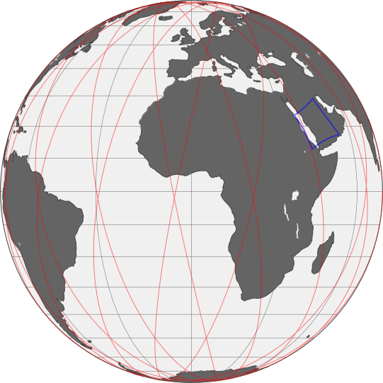

# Open Space Toolkit ▸ Astrodynamics

[](https://github.com/open-space-collective/open-space-toolkit-astrodynamics/actions/workflows/build-test.yml)
[](https://codecov.io/gh/open-space-collective/open-space-toolkit-astrodynamics)
[](https://open-space-collective.github.io/open-space-toolkit-astrodynamics)
[](https://badge.fury.io/gh/open-space-collective%2Fopen-space-toolkit-astrodynamics)
[](https://badge.fury.io/py/open-space-toolkit-astrodynamics)
[](https://opensource.org/licenses/Apache-2.0)

Orbit, attitude, access, mission analysis.



## Getting Started

Want to get started? This is the simplest and quickest way:

[](https://mybinder.org/v2/gh/open-space-collective/open-space-toolkit/main?urlpath=lab/tree/notebooks)

*Nothing to download or install! This will automatically start a [JupyterLab](https://jupyterlab.readthedocs.io/en/stable/) environment in your browser with Open Space Toolkit libraries and example notebooks ready to use.*

### Alternatives

#### Docker Images

[Docker](https://www.docker.com/) must be installed on your system.

##### iPython

The following command will start an [iPython](https://ipython.org/) shell within a container where the OSTk components are already installed:

```shell
docker run -it openspacecollective/open-space-toolkit-astrodynamics-python
```

Once the shell is up and running, playing with it is easy:

```py
from ostk.physics import Environment
from ostk.physics.time import Instant
from ostk.astrodynamics.trajectory import Orbit
from ostk.astrodynamics.trajectory.orbit.models import SGP4
from ostk.astrodynamics.trajectory.orbit.models.sgp4 import TLE

tle = TLE(
    '1 25544U 98067A   18231.17878740  .00000187  00000-0  10196-4 0  9994',
    '2 25544  51.6447  64.7824 0005971  73.1467  36.4366 15.53848234128316'
)  # Construct Two-Line Element set

earth = Environment.default().access_celestial_object_with_name('Earth')  # Access Earth model

orbit = Orbit(SGP4(tle), earth)  # Construct orbit using SGP4 model

orbit.get_state_at(Instant.now())  # Compute and display current satellite state (position, velocity)
```

By default, OSTk fetches the ephemeris from JPL, Earth Orientation Parameters (EOP) and leap second count from IERS.

As a result, when running OSTk for the first time, it may take a minute to fetch all the necessary data.

*Tip: Use tab for auto-completion!*

##### JupyterLab

The following command will start a [JupyterLab](https://jupyterlab.readthedocs.io/en/stable/) server within a container where the OSTk components are already installed:

```shell
docker run --publish=8888:8888 openspacecollective/open-space-toolkit-astrodynamics-jupyter
```

Once the container is running, access [http://localhost:8888/lab](http://localhost:8888/lab) and create a Python 3 Notebook.

## Installation

### C++

The binary packages are hosted using [GitHub Releases](https://github.com/open-space-collective/open-space-toolkit-astrodynamics/releases):

- Runtime libraries: `open-space-toolkit-astrodynamics-X.Y.Z-1.x86_64-runtime`
- C++ headers: `open-space-toolkit-astrodynamics-X.Y.Z-1.x86_64-devel`
- Python bindings: `open-space-toolkit-astrodynamics-X.Y.Z-1.x86_64-python`

#### Debian / Ubuntu

After downloading the relevant `.deb` binary packages, install:

```shell
apt install open-space-toolkit-astrodynamics-*.deb
```

### Python

Install from [PyPI](https://pypi.org/project/open-space-toolkit-astrodynamics/):

```shell
pip install open-space-toolkit-astrodynamics
```

## Documentation

Documentation is available [here](https://open-space-collective.github.io/open-space-toolkit-astrodynamics):

<details>
<summary>Structure</summary>
<p>

The library exhibits the following detailed and descriptive structure:

```txt
├── NumericalSolver
├── Trajectory
│   ├── State
│   ├── Orbit
│   │   ├── Models
│   │   │   ├── Kepler
│   │   │   │   └── Classical Orbital Elements (COE)
│   │   │   ├── SGP4
│   │   │   │   └── Two-Line Element set (TLE)
│   │   │   ├── Tabulated (input csv)
│   │   │   └── Propagated (numerical integration)
│   │   ├── Pass
│   │   └── Messages
│   │       └── SpaceX
│   │           └── OPM
│   ├── Models
│   │   ├── Static
│   │   └── Tabulated
│   └── Propagator
├── Flight
│   ├── Profile
│   │    ├── Models
│   │    │   ├── Transform
│   │    │   └── Tabulated
│   │    └── State
│   └── System
│        ├── SatelliteSystem
│        └── Dynamics
│            └── PositionDerivative
│            └── CentralBodyGravity
│            └── ThirdBodyGravity
│            └── AtmosphericDrag
├── Access
│   └── Generator
└── Conjunction
    └── Messages
        └── CCSDS
            └── CDM
```

</p>
</details>

## Tutorials

Tutorials are available here:

- C++ (in progress)
- [Python](https://github.com/open-space-collective/open-space-toolkit/tree/main/notebooks)

## Setup

### Development Environment

Using [Docker](https://www.docker.com) for development is recommended, to simplify the installation of the necessary build tools and dependencies.
Instructions on how to install Docker are available [here](https://docs.docker.com/install/).

To start the development environment:

```shell
make start-development
```

This will:

1. Build the `openspacecollective/open-space-toolkit-astrodynamics-development` Docker image.
2. Create a development environment container with local source files and helper scripts mounted.
3. Start a `bash` shell from the `./build` working directory.

If installing Docker is not an option, you can manually install the development tools (GCC, CMake) and all required dependencies,
by following a procedure similar to the one described in the [Development Dockerfile](./docker/development/Dockerfile).

### Build

From the `./build` directory:

```shell
cmake ..
make
```

*Tip: The `ostk-build` command simplifies building from within the development environment.*

### Test

To start a container to build and run the tests:

```shell
make test
```

Or to run them manually:

```shell
./bin/open-space-toolkit-astrodynamics.test
```

*Tip: The `ostk-test` command simplifies running tests from within the development environment.*

### Benchmark

To run benchmarks:

```shell
make benchmark
```

Benchmarks are pushed to the [GitHub pages](https://open-space-collective.github.io/open-space-toolkit-astrodynamics/dev/bench/).

### Validation

OSTk has a cross-validation framework built into it (inside the `/validation` folder), which allows us to compare its end-to-end propagation accuracy of a full "mission sequence" to other flight qualified tools like GMAT and Orekit.

#### Scenario Definition

A standardized input format (a yaml file) to define the particular mission sequence scenario is used, and is tooling agnostic. An example of it is shown below.

- The spacecraft's parameters and initial state are defined under the `spacecraft` header
- The sequence header contains the dynamic forces to be applied during propagation, the type of numerical propagator to use, and the segments (burning or coasting) to execute during the mission sequence
- Finally, the output header contains the quantities that we want to output (in this case time elapsed, position, and velocity), and the interval at which to report them

```yaml
type: MISSION_SEQUENCE
data:
  spacecraft:
    mass: 100.0
    drag-cross-section: 1.0
    drag-coefficient: 2.2
    orbit:
      type: CARTESIAN
      data:
        date:
          time-scale: UTC
          value: "2023-01-01T00:00:00"
        frame: GCRF
        body: EARTH
        x: -4283387.412456233
        y: -4451426.776125101
        z: -2967617.850750065
        vx: 4948.074939732174
        vy: -957.3429532772124
        vz: -5721.173027553034

  sequence:
    max-duration: 86400.1
    forces:
      - type: GRAVITY
        data:
          body: EARTH
          model: EGM96
          degree: 0
          order: 0
    propagator:
      type: RUNGE_KUTTA_DORMAND_PRINCE_45
      data:
        initial-step: 30.0
        min-step: 0.001
        max-step: 2700.0
        relative-tolerance: 1.0e-12
        absolute-tolerance: 1.0e-12
    segments:
      - type: COAST
        data:
          stop-condition:
            type: RELATIVE_TIME
            data:
              duration: 86400.0

  output:
    step: 120.0
    include:
      - ELAPSED_SECONDS
      - CARTESIAN_POSITION_GCRF
      - CARTESIAN_VELOCITY_GCRF
```

#### Cross Validation and Accuracy Tolerances

The validation framework takes this yaml scenario definition (from the `/validation/data/scenarios` folder) and runs the scenario using OSTk. Next, it compares the specified outputs (quantities like the position, velocity, mass, acceleration of the spacecraft) at the desired reporting step generated by OSTk with each external validation tool (whose outputs were generated via the same process and are in the `/validation/data/gmat_astrodynamics` or `/validation/data/orekit_astrodynamics` folder as `.csv`), to ensure they are within a certain tolerance of each other.

**To add a scenario:**
1. Write a scenario definition using the `.yaml` format above, and name it `scenarioX-mission-sequence.yaml`, and put it in wth the others. If the format isn't correct or there is another issue, OSTk will throw an error when validating.
2. Generate the `.csv` outputs from the external tools you want to compare OSTk against (repos with an GMAT and Orekit wrapper that can ingest this `.yaml` format do exist and will be open sourced soon).
3. Add another test case to the `Framework.validation.cpp` file, with the scenario name, the tool to compare against, and the output quantities and comparison tolerances for those. An exampe of this is provided below.

```cpp
{
    "scenario001-mission-sequence",  // Spherical gravity only
    {
        {
            Tool::GMAT,
            {
                {Quantity::CARTESIAN_POSITION_GCRF, 1.1e-0},
                {Quantity::CARTESIAN_VELOCITY_GCRF, 1.2e-3},
            },
        },
        {
            Tool::OREKIT,
            {
                {Quantity::CARTESIAN_POSITION_GCRF, 1.1e-0},
                {Quantity::CARTESIAN_VELOCITY_GCRF, 1.2e-3},
            },
        },
    },
},
```

#### Running the Validation Tests
The validation tests can be run with `ostk-validate` from within the dev container, or `make validation` as a standalone.

## Dependencies

| Name        | Version   | License            | Link                                                                                                                                       |
| ----------- | --------- | ------------------ | ------------------------------------------------------------------------------------------------------------------------------------------ |
| Pybind11    | `2.10.1`  | BSD-3-Clause       | [github.com/pybind/pybind11](https://github.com/pybind/pybind11)                                                                           |
| ordered-map | `0.6.0`   | MIT                | [github.com/Tessil/ordered-map](https://github.com/Tessil/ordered-map)                                                                     |
| Eigen       | `3.3.7`   | MPL2               | [eigen.tuxfamily.org](http://eigen.tuxfamily.org/index.php)                                                                                |
| SGP4        | `6a448b4` | Apache License 2.0 | [github.com/dnwrnr/sgp4](https://github.com/dnwrnr/sgp4)                                                                                   |
| NLopt       | `2.5.0`   | LGPL               | [github.com/stevengj/nlopt](https://github.com/stevengj/nlopt)                                                                             |
| benchmark   | `1.8.2`   | Apache License 2.0 | [github.com/google/benchmark](https://github.com/google/benchmark)                                                                             |
| Core        | `main`    | Apache License 2.0 | [github.com/open-space-collective/open-space-toolkit-core](https://github.com/open-space-collective/open-space-toolkit-core)               |
| I/O         | `main`    | Apache License 2.0 | [github.com/open-space-collective/open-space-toolkit-io](https://github.com/open-space-collective/open-space-toolkit-io)                   |
| Mathematics | `main`    | Apache License 2.0 | [github.com/open-space-collective/open-space-toolkit-mathematics](https://github.com/open-space-collective/open-space-toolkit-mathematics) |
| Physics     | `main`    | Apache License 2.0 | [github.com/open-space-collective/open-space-toolkit-physics](https://github.com/open-space-collective/open-space-toolkit-physics)         |

## Contribution

Contributions are more than welcome!

For the contributing guide, please consult the CONTRIBUTING.md in the [open-space-toolkit](https://github.com/open-space-collective/open-space-toolkit) base repo [here](https://github.com/open-space-collective/open-space-toolkit/blob/main/CONTRIBUTING.md).

## Special Thanks

[](https://www.loftorbital.com/)

## License

Apache License 2.0
